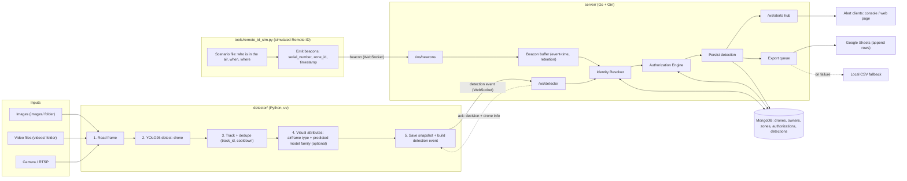
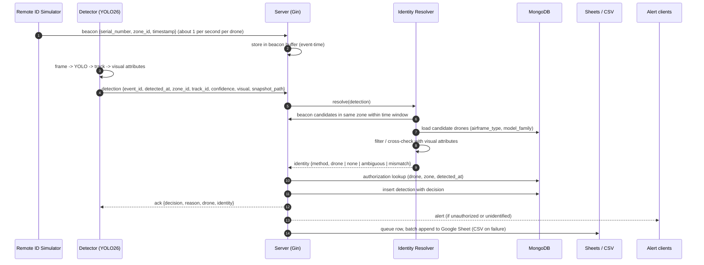
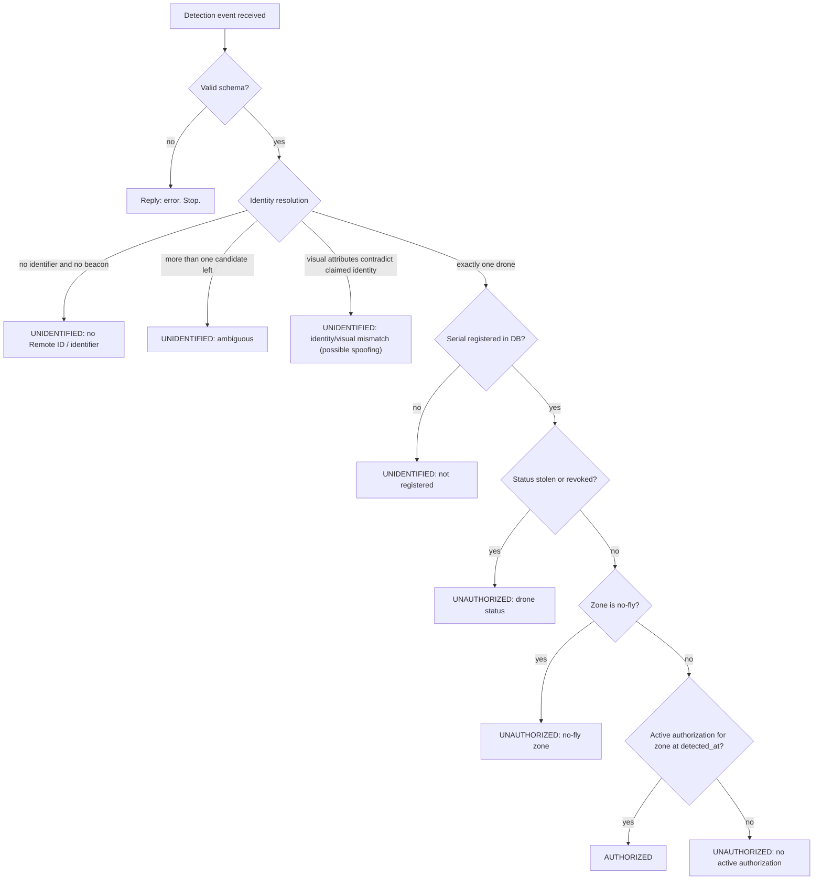

# Drone Detect App — Detection & Authorization System

> Detect drones in images and video with YOLO, identify them, check whether they are
> authorized to be in a given area, and notify + log every detection.

## 1. Goal

A local system (Windows development machine) that:

1. Runs a **YOLO detector** (Python, managed with `uv`) on images, video files, or a camera stream.
2. Sends a **real-time event over WebSocket** to a **Go server built with the Gin framework** each time a drone is detected.
3. The server **resolves the drone's identity**, looks it up in **MongoDB**, decides
   **authorized / unauthorized / unidentified** for the zone where it was seen, and **notifies** subscribers.
4. Every detection is **logged to a Google Sheet** (local CSV fallback).

---

## 2. Versioning policy and current versions

**Rule: always use the latest stable version of every framework, library, and tool.**

- Never write a version number from memory. Verify it (web search, or the registry/CLI) before adding or documenting a dependency.
- Go: `go get <module>@latest`, then `go mod tidy`. Python: `uv add <package>` (resolves the latest), `uv lock --upgrade`.
- Lock files (`go.sum`, `uv.lock`) give reproducibility; this table is a **dated snapshot**, not a pin.
- If a dependency has no release compatible with the latest stable Python/Go yet, use the newest version that works and note it in the PR/commit message.

**Snapshot verified on 2026-10-06** (sources: PyPI, upstream Git tags, official MongoDB and Ultralytics docs). The Ultralytics row was refreshed from PyPI on 2026-10-09:

| Area | Component | Latest stable | Notes |
|---|---|---|---|
| Go | Go toolchain | **1.27.1** | |
| Go | Gin (`github.com/gin-gonic/gin`) | **v1.12.0** | HTTP framework + routing |
| Go | gorilla/websocket (`github.com/gorilla/websocket`) | **v1.5.3** | Upgrader works directly with Gin's `ResponseWriter` |
| Go | MongoDB Go driver (`go.mongodb.org/mongo-driver/v2`) | **v2.9.1** | Use the `/v2` module path |
| Go | Google API client (`google.golang.org/api`) | **v0.300.0** | Sheets API v4 lives in `.../sheets/v4` |
| Go | google/uuid (`github.com/google/uuid`) | **v1.6.0** | |
| Go | joho/godotenv (`github.com/joho/godotenv`) | **v1.5.1** | Load `.env` in dev |
| Go | stretchr/testify (`github.com/stretchr/testify`) | **v1.12.1** | Test assertions |
| Python | Python | **3.14.8** | Install with `uv python install 3.14` |
| Python | uv | **0.12.23** | |
| Python | Ultralytics (package) | **8.4.174** | Latest model family: **YOLO26** (released Jan 2026), e.g. `yolo26n.pt`, `yolo26n-cls.pt` |
| Python | PyTorch / torchvision | **2.14.1 / 0.29.1** | CPU or CUDA build, see official PyTorch install selector |
| Python | opencv-python | **5.0.0.93** | Use `opencv-python-headless` on servers without display |
| Python | numpy | **2.5.3** | Frame arrays in `detector/detect.py` |
| Python | lap | **0.5.13** | Linear assignment for ByteTrack (`detector` tracking) |
| Python | websockets | **17.2** | |
| Python | pydantic / pydantic-settings | **2.13.5 / 2.15.0** | |
| Python | typer | **0.27.2** | CLI |
| Python | pymongo | **4.18.2** | Seed tool, simulator |
| Python | Faker | **40.41.0** | Mock data |
| Python | pytest / pytest-asyncio | **9.1.1 / 1.4.0** | |
| Python | ruff | **0.16.10** | Lint + format |
| Python (optional) | Hugging Face `transformers` | **5.18.0** | Only if a stronger classifier backbone is needed (section 5) |
| Database | MongoDB Community Server | **8.3.x** (latest minor) | 8.0 is the latest *major* release. Install the newest from the MongoDB Download Center; Compass and `mongosh` latest. |

> **Licensing note:** Ultralytics YOLO is offered under AGPL-3.0 or an Enterprise license. Fine for a personal/local project; check before any commercial distribution.

---

## 3. Pipeline (read this before coding)

### 3.1 End-to-end flow



### 3.2 Sequence for one detection



### 3.3 Decision flow (server)



### 3.4 Stage table (inputs, outputs, failure behavior)

| # | Stage | Component | Input | Output | On failure |
|---|---|---|---|---|---|
| 1 | Read | `detector/sources.py` | image / video / stream | frame + timestamp | Skip frame, log; stop at end of source |
| 2 | Detect | `detector/detect.py` | frame | bounding boxes + confidence | Log and continue |
| 3 | Track + summarize | `detector/tracking.py` | boxes | `track_id`, best frame per track | Files: one summary per confirmed track at end; streams: "emit now?" flag |
| 4 | Visual attributes | `detector/attributes.py` | crop of the best box | `airframe_type`, predicted `model_family` + confidences (optional) | Omit `visual` (resolver skips the cross-check) |
| 5 | Event | `detector/events.py`, `ws_client.py` | best frame per track | `detection` JSON over WebSocket | Buffer in bounded queue, reconnect with backoff; preserve snapshots with a visual family prediction |
| 6 | Beacons | `tools/remote_id_sim.py` | scenario file | `beacon` JSON over WebSocket | Reconnect; beacons are not persisted |
| 7 | Resolve identity | `server/internal/identity` | detection + beacon buffer + DB | identity result | Unknown or ambiguous becomes `unidentified` |
| 8 | Decide | `server/internal/authorization` | identity + zone + time | decision + reason | Any error becomes `unidentified` + logged, never a crash |
| 9 | Persist + reply | `server/internal/store`, `ws` | decision | stored detection, `ack` | Reply `error`, keep the connection |
| 10 | Notify | `server/internal/notify` | decision | `alert` message | Slow clients are dropped, never block the pipeline |
| 11 | Export | `server/internal/export` | stored detection | Sheet row, or CSV fallback | Identified only (`EXPORT_IDENTIFIED_ONLY`); retry with backoff, mark `export_status` |

---

## 4. Key design decisions

| Topic | Decision | Why |
|---|---|---|
| Server framework | **Gin** | Fast, simple routing and middleware; WebSocket upgrade via gorilla/websocket inside a Gin handler. |
| Detection vs. identification | **Separate problems** | YOLO can say "a drone is here"; it cannot read a serial number from pixels. See section 5. |
| Transport | **WebSocket** (JSON) | Real-time, bidirectional (events up, acks down). |
| Output sink | **One Google Sheet, append rows** (CSV fallback) | One file per detection on Drive is messy and slow. |
| Dedupe | **Tracking + end-of-file summary** (streams: cooldown) | A drone visible for 10 s at 30 FPS otherwise creates about 300 events; files now emit one summary per track. |
| Sheets writes | **Batched** | Sheets API has per-minute write quotas. |
| Time basis | **Event time** (`detected_at`, beacon `timestamp`), not arrival time | Replaying a video must give deterministic results. |
| Weights | **Fine-tuned drone model (YOLO26)** | COCO-pretrained YOLO has no `drone` class. |

---

## 5. Identification: the simulation design

### 5.1 The problem

YOLO outputs *"a drone at this position, confidence 0.91."* It cannot know **which** drone. And a tracker's `track_id`
is **temporary** (resets every run) and must never be used as a database key. We need a **persistent, unique identity**
(the drone's serial number) to answer "is *this* drone authorized?".

### 5.2 Options considered

| Option | Verdict |
|---|---|
| Ascending numeric IDs assigned by YOLO / tracker | **No.** Not persistent, not linked to the DB, any drone just gets "the next number". Use `track_id` only for dedupe. |
| Random drone picked from the DB per detection | Only for a throwaway smoke test (`fake_detector.py`). Tests nothing realistic. |
| Per-video manifest: "seconds 3–14 of this video = serial X" | **Good and simple.** Deterministic. Used inside the scenario file below. |
| Hugging Face / YOLO-cls model that recognizes the exact drone | **No.** A classifier gives a *class* ("Mavic-like quadcopter"), never a unique drone. Hundreds of drones share a model. |
| QR / ArUco tag on the drone | Real option for later (hardware needed). |
| **Simulated Remote ID beacons + correlation with the camera detection, cross-checked by visual attributes** | **Recommended.** See below. |

### 5.3 Recommended: Simulated Remote ID + visual cross-check

Real **Remote ID** drones broadcast their serial/session ID over radio; a receiver hears it; the system correlates
it with what the camera sees. We simulate exactly that, so a real receiver can replace the simulator later without
changing the server.

**Three identity sources, tried in order (the resolver, `server/internal/identity`):**

1. **Explicit identifier** in the detection event (`identifier.kind = serial | qr | remote_id`). Used by `fake_detector.py` and future QR tags.
2. **Beacon correlation:** find beacons in the **same zone** whose `timestamp` is within `BEACON_WINDOW_S` (default 3 s) of `detected_at`.
   - **0 candidates:** the drone is visible but **not broadcasting** → `unidentified` (this is the realistic "rogue drone" case).
   - **1 candidate:** identified.
   - **More than 1:** narrow down using visual attributes (step 3). Still more than 1 → `ambiguous` → `unidentified`.
3. **Visual attributes cross-check** (when the detector supplies `visual` with enough confidence):
   - Compare each available confident visual attribute independently: `airframe_type` (quadcopter, hexacopter, fixed_wing, vtol, ...) and/or `model_family` (Mavic, Mini, Anafi, ...). The classifier's family output is a broad visual prediction, never an exact product SKU.
   - **Disambiguates** several beacons (keep only the compatible ones).
   - **Detects spoofing:** a beacon claims an authorized quadcopter, but the camera sees a fixed-wing → `mismatch` → `unidentified` + alert.

**What the "category" and "model" models are for.** They do **not** identify the drone. They provide *attributes* used to
verify or disambiguate an identity that came from elsewhere.

### 5.4 Attribute models: how far to go (staged)

| Stage | What | Needs | When |
|---|---|---|---|
| A | No visual attributes; `visual` omitted | Nothing | M2–M5 |
| B | **Multi-class YOLO26 detector**: classes = airframe types (e.g. `quadcopter`, `fixed_wing`, `multirotor_heavy`) | A dataset labeled by airframe type, or relabel one | M8 |
| C | **Crop classifier for `model_family`**: Ultralytics **YOLO26-cls** fine-tuned on labeled crops; the available showcase dataset supports Mavic/Phantom/Inspire families, not exact product SKUs | Labeled images per family | M8 (optional; showcase prototype) |
| D | Hugging Face backbone (e.g. a DINOv2-style vision model via `transformers`) with a small classification head | Only if C is not accurate enough | Later |

Recommendation: **start at A**, build and test the whole pipeline with *simulated* `visual` values in
`fake_detector.py`, then add B, then C only if you want model-level checks. Fine-grained model recognition from small,
distant drones is hard; treat it as a *soft* signal (use confidence thresholds, never as the only evidence).

### 5.5 Scenario file (drives the simulator and the tests)

A scenario describes what "really" happens in a test video, so the simulator and detector agree on time.
Format: see `DESCRIPTION.md` section 6. Typical scenario: one authorized drone (broadcasting), one rogue drone
(not broadcasting), one spoofer (broadcasting someone else's serial but a different airframe), one drone in a no-fly zone.

---

## 6. Tech stack (summary; versions in section 2)

**Detector (Python, `uv`):** ultralytics (YOLO26), opencv-python, websockets, pydantic, pydantic-settings, typer, pytest, pytest-asyncio, ruff

**Server (Go + Gin):** gin, gorilla/websocket, mongo-driver v2, google.golang.org/api (Sheets v4), google/uuid, godotenv, testify, stdlib `log/slog`

**Tools (Python `uv` scripts):** pymongo, faker, websockets

**Infra (local, Windows):** MongoDB Community Server (Windows service) + Compass, Google Cloud service account for the Sheets API (keyless via Application Default Credentials, or a key file where allowed), optional NVIDIA GPU + CUDA PyTorch.

---

## 7. Repository layout

```
drone-detect-app/
├── PROJECT.md
├── DESCRIPTION.md
├── AGENTS.md                  # instructions for AI coding assistants
├── .env.example
├── .gitignore
├── .gitattributes             # normalize line endings (Windows)
├── detector/                  # Python / uv
│   ├── pyproject.toml
│   ├── src/detector/
│   │   ├── main.py            # CLI entrypoint (typer)
│   │   ├── config.py          # pydantic-settings
│   │   ├── sources.py         # image / video / stream readers
│   │   ├── detect.py          # YOLO26 wrapper
│   │   ├── tracking.py        # track IDs, dedupe, cooldown
│   │   ├── attributes.py      # optional airframe/model classifier
│   │   ├── events.py          # pydantic event models
│   │   └── ws_client.py       # reconnecting WebSocket client
│   ├── models/                # *.pt weights (gitignored)
│   ├── tools/
│   │   ├── train_family_classifier.py   # fine-tune optional visual family head
│   │   └── render_family_showcase.py    # local image showcase; no server events
│   └── tests/
├── server/                    # Go + Gin
│   ├── go.mod
│   ├── cmd/server/main.go
│   └── internal/
│       ├── config/
│       ├── model/             # shared structs
│       ├── api/               # Gin router, middleware, /health
│       ├── ws/                # /ws/detector, /ws/beacons, /ws/alerts
│       ├── store/             # MongoDB repositories
│       ├── identity/          # beacon buffer + resolver
│       ├── authorization/     # decision engine
│       ├── export/            # Sheets exporter + CSV fallback
│       └── notify/
├── tools/
│   ├── seed_db.py             # mock drones, owners, zones, authorizations
│   ├── fake_detector.py       # sends scripted detection events
│   └── remote_id_sim.py       # simulated Remote ID beacons from a scenario
├── scenarios/                 # scenario JSON files
├── data/                      # snapshots, CSV exports (gitignored)
├── videos/                    # INPUT: my test videos (provided by me, gitignored)
├── images/                    # INPUT: my test images (provided by me, gitignored)
└── docs/
```

---

### Input data folders (provided by the project owner)

| Folder | Content | How the project uses it |
|---|---|---|
| `videos/` | Test videos (`.mp4`, `.avi`, `.mov`, `.mkv`, `.webm`) | Default **video sources** for the detector (`--source videos\<file>` or `--source videos` for the whole folder); referenced by scenario files; the drone-free clip used to measure false positives. |
| `images/` | Test images (`.jpg`, `.jpeg`, `.png`, `.bmp`, `.webp`) | Default **image sources** for the detector (`--source images\<file>` or `--source images` for the whole folder). |

These folders already exist and contain my files. Agents must **read from them, never modify, rename, move, or delete** anything in them,
must not commit their content, and must **discover files at runtime** (list the folder) instead of hard-coding file names.

---

## 8. Roadmap

| # | Milestone | Done when |
|---|---|---|
| M0 | Scaffolding | Layout, `uv` project, Go module with Gin, `.env.example`; both apps start. |
| M1 | Database + seed | `uv run tools/seed_db.py` creates collections and ~50 consistent mock drones (with `airframe_type`, `model_family`), owners, zones, authorizations. |
| M2 | Gin server core | `/ws/detector` accepts events with an **explicit identifier**; decision engine works; detections stored. Tested with `fake_detector.py`. |
| M3 | Detector on images | YOLO26 runs on an image and sends a valid event; server acks. |
| M4 | Video + tracking | One event per tracked drone with cooldown; works on video file and webcam. |
| M5 | **Remote ID simulator + identity resolver** | `/ws/beacons`, beacon buffer, resolver with correlation and visual cross-check; scenario files; all four cases (authorized, rogue, spoofer, no-fly) behave correctly end to end. |
| M6 | Google Sheets export | Rows appear in the sheet; CSV fallback and retry verified. |
| M7 | Alerts | `/ws/alerts` pushes alerts; minimal web page shows them live. |
| M8 | Fine-tuning + visual attributes + hardening | Fine-tuned YOLO26 weights with metrics; optional airframe/model classifier feeding `visual`; logging, graceful shutdown, README. |

**Recommended order:** M1 → M2 → M5 first with simulated data. The server, the data model, and the identity logic do not
depend on a trained drone model, so you are never blocked on training.

---

## 9. Out of scope (for now)

- Real Remote ID receivers, RF sensors, or QR hardware (the design leaves a slot for them)
- Multi-camera geolocation / 3D position estimation
- Authentication / multi-user dashboard
- Cloud deployment
