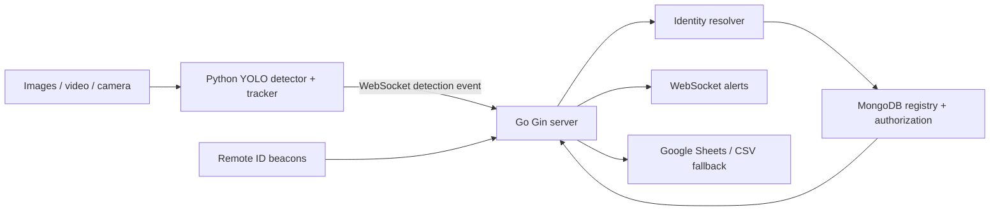

# Drone Detect App

Drone Detect App combines visual drone detection with a Go backend for event processing, Remote ID matching, authorization decisions, alerts, and reporting.

## Project status

- The detector's labels depend on the local weights. If `detector/models/drone.pt` is absent, the Makefile uses a pretrained fallback configured for the `airplane` class; this is a demo stand-in and can miss real drones. A detection box and confidence score are not a product-model prediction.
- The server resolves registered identity from an explicit identifier or Remote ID beacon, then checks authorization for the zone and event time.
- The optional visual family classifier is experimental. In the real-footage MMAUD test, it labeled 10.8% of all test drones correctly end to end; the detector missed 78.1% of targets. It has not replaced the production checkpoint.
- Visual predictions are supporting evidence. Use a serial number or Remote ID matched to the registry for registered identity.

See [the November plan](./docs/NEXT_NOVEMBER.md) for the measured gaps and recommended next steps.

Stack: Python and `uv`, Ultralytics YOLO and OpenCV, Go and Gin, WebSockets, MongoDB, and Google Sheets with a CSV fallback.

## What the system does

1. Reads an image, video, or camera stream.
2. Uses YOLO to detect and track objects.
3. Sends detection events to the Go server over WebSocket.
4. Resolves identity using an explicit identifier or Remote ID beacons matched by zone and event time.
5. Checks registration and authorization in MongoDB.
6. Notifies alert clients and exports detection records to Google Sheets or local CSV.

The tracker ID is temporary and is used for deduplication only. It is not a drone identity.

## Architecture



## Detection examples

These screenshots show object detection only. A source photo's known make and model are not predictions made by the detector.

<p align="center">
  
</p>

The following annotated examples use Wikimedia Commons photos. Credits and licenses are listed in [SHOWCASE_MEDIA.md](./docs/SHOWCASE_MEDIA.md).

<p align="center">
  
</p>

<p align="center">
  
</p>

## Visual family experiment

The separate classifier was evaluated on 584 held-out MMAUD crops labeled by flight sequence as Mavic 2, Mavic 3, Phantom 4, Avata, or M300. It reached 51.4% exact-class accuracy on the crops, or 58.7% after merging Mavic 2 and Mavic 3. In the full detector-plus-classifier pipeline, 78.1% of labeled targets were missed and only 10.8% received the correct family label.

The test split was held out in time, but its flights also appeared in training. Results on new scenes are unknown. The candidate checkpoint remains experimental and was not promoted.

<p align="center">
  
</p>

<p align="center">
  
</p>

MMAUD V1 is shared under CC BY-NC-SA 4.0. See [dataset attribution](./docs/MMAUD_ATTRIBUTION.md) and the full [evaluation report](./docs/MMAUD_REPORT.md).

## Quick start on Windows

Prerequisites:

- MongoDB Community Server running at `mongodb://localhost:27017`.
- A repository-root `.env` created from `.env.example`.
- `uv`, Go, and (for Makefile commands) `make` installed.

To add demo records without wiping the database:

```powershell
uv run tools\seed_db.py --keep
```

Run the server from the repository root:

```powershell
cd server
go run .\cmd\server
```

Run the detector on the provided image folder from another terminal:

```powershell
cd detector
uv run python -m detector.main --source ..\images
```

The `images/` and `videos/` folders are read-only test inputs. List them before selecting a particular file; do not modify, rename, move, or delete their contents.

## Full local workflow

If `make` is installed, start the server and video detector in separate terminals from the repository root:

```powershell
make server
```

```powershell
make yolo
```

The default scenario can exercise the simulated Remote ID and backend decision paths in additional terminals:

```powershell
make sim
make fake
```

The simulator and fake detector test backend scenarios. They do not prove that the vision model recognized a registered product model. The dashboard is available at `http://localhost:8000/` when the server is running.

Other useful commands:

```powershell
make check       # check prerequisites
make gpu-check   # report PyTorch CUDA availability
make yolo-images # run detection on images/
make webcam      # use webcam 0; press q to stop
make test        # run Go and Python tests
```

## Tests

```powershell
cd server
go test ./...
go vet ./...
cd ..\detector
uv run pytest -q
uv run ruff check .
```

## Project documentation

- [November plan](./docs/NEXT_NOVEMBER.md) — test findings and prioritized work.
- [PROJECT.md](./PROJECT.md) — architecture, milestones, and version snapshot.
- [DESCRIPTION.md](./DESCRIPTION.md) — schemas, event protocol, identity resolution, and decision logic.
- [Architecture notes](./docs/ARCHITECTURE.md) — repository map and diagrams.
- [Training notes](./docs/TRAINING.md) — dataset and model workflow.
- [MMAUD report](./docs/MMAUD_REPORT.md) — real-footage experiment, metrics, and limitations.
- [Showcase media credits](./docs/SHOWCASE_MEDIA.md) — source and license details for example images.

## License and scope

This is a local development and validation project for drone detection, event processing, authorization checks, and alerts. It does not currently identify arbitrary drone models from pixels. Check the Ultralytics license terms before any commercial distribution.
