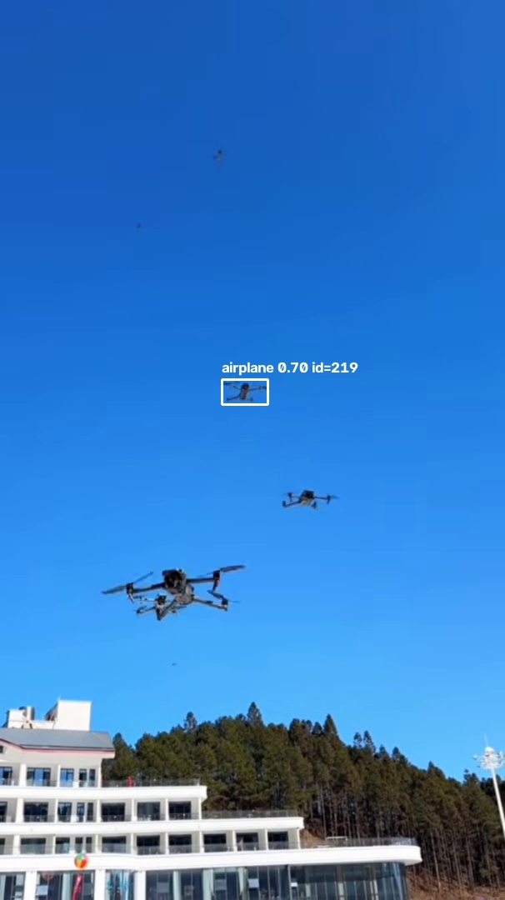
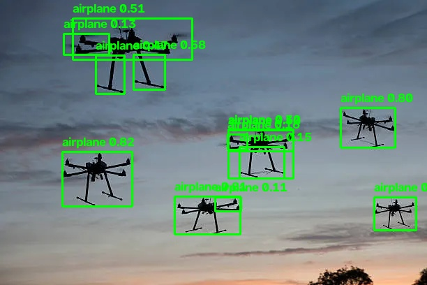
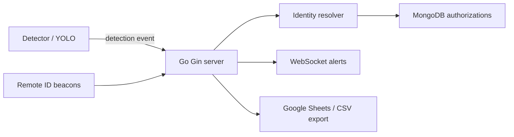

# Drone Detect App

<p align="center">
  
  
  
  
  
  
</p>

A local drone detection and authorization system that combines computer vision, real-time event processing, and rule-based identity verification. The detector runs YOLO on live or recorded sources, the Go server resolves identity and authorization status, and every detection is exported to Sheets or CSV for auditing.

## Tech stack

| Layer | Technologies |
| --- | --- |
| Vision + detection | Python, `uv`, Ultralytics YOLO26, OpenCV, PyTorch |
| Live backend | Go, Gin, Gorilla WebSockets |
| Identity + decisioning | Go server logic, MongoDB lookups, zone-aware authorization checks |
| Storage | MongoDB Community Server |
| Reporting | Google Sheets API + local CSV fallback |
| Automation | PowerShell, Makefile, pytest, Go tests |

## Overview

This project is designed to answer a simple but important operational question: when a drone is detected in a monitored area, is it authorized to be there, and who is it? The detector identifies a drone, emits a real-time event, and the server correlates it with Remote ID beacons and visual attributes to decide whether the flight is authorized or not.

The system supports:

- Drone detection from images, folders, videos, and streams
- Tracking with `track_id` dedupe and cooldown logic
- Remote ID beacon matching by zone and timestamp
- Visual attribute-based verification (`airframe_type`, `model_family`)
- MongoDB-backed drone and authorization checks
- Live alerts over WebSocket
- Export to Google Sheets with CSV fallback

## YOLO detector output

These are the two best detection snapshots captured by the detector pipeline:

<p align="center">
  
</p>

<p align="center">
  
</p>

`images/` and `videos/` stay read-only inputs; the runtime detection snapshots live under `data/snapshots/`.

## Architecture at a glance



## Project documentation

- [PROJECT.md](./PROJECT.md) — roadmap, architecture, version snapshot, milestones
- [DESCRIPTION.md](./DESCRIPTION.md) — contract and source-of-truth behavior for events, decision logic, and schemas
- [docs/ARCHITECTURE.md](./docs/ARCHITECTURE.md) — deeper repo map and diagrams
- [docs/TRAINING.md](./docs/TRAINING.md) — training and dataset notes

## Repository structure

```text
.
├── detector/                  # YOLO detector, tracking, event generation
├── server/                    # Gin API and decision engine
├── tools/                     # seed DB, simulator, fake detector utilities
├── scenarios/                 # Remote ID / test scenario JSON files
├── images/                    # sample images used for testing and docs
├── videos/                    # sample videos used for testing
├── docs/                      # architecture and training notes
├── data/                      # snapshots, export outputs, app data
├── PROJECT.md                 # milestones and architecture overview
├── DESCRIPTION.md             # rules, schemas, and protocol contracts
├── README.md                  # project overview and quick start
├── Makefile                   # shortcut automation for common tasks
├── .env.example               # environment template
└── scripts/                   # demo and run helpers
```

## Quick start (Windows PowerShell)

Prerequisites:

- MongoDB Community Server running at `mongodb://localhost:27017`
- Repo-root `.env` created from `.env.example`

### Option 1: use the provided automation

```powershell
make seed
make server
make yolo
```

### Option 2: run each service manually

```powershell
# 1. Seed mock data
.\detector\.venv\Scripts\python.exe tools\seed_db.py

# 2. Run the server
cd server
go run .\cmd\server
# dashboard: http://localhost:8080/
# health: http://localhost:8080/health

# 3. Run the detector
cd ..
cd detector
.\.venv\Scripts\python.exe -m detector.main --source ..\images --clock video
```

### Simulated Remote ID and fake detections

```powershell
.\detector\.venv\Scripts\python.exe tools\remote_id_sim.py --scenario scenarios\demo1.json --mode preload
.\detector\.venv\Scripts\python.exe tools\fake_detector.py --scenario scenarios\demo1.json
```

### Demo helpers

```powershell
.\scripts\demo.ps1 check
.\scripts\demo.ps1 seed
.\scripts\demo.ps1 server
.\scripts\demo.ps1 sim
.\scripts\demo.ps1 fake
.\scripts\demo.ps1 dashboard
```

## How the system works

1. The detector reads frames from an image, video, or stream.
2. YOLO identifies drone objects and emits a detection event.
3. The server validates and enriches the event.
4. It resolves identity using explicit identifiers, Remote ID beacons, and visual checks.
5. It looks up authorization for the zone and time of detection.
6. It decides whether the drone is `authorized`, `unauthorized`, or `unidentified`.
7. It publishes alerts and exports the record for auditing.

## Testing

```powershell
cd server
 go test ./...
 go vet ./...

cd ..\detector
.\.venv\Scripts\python.exe -m pytest -q
```

## Notes

- `videos/` and `images/` are treated as read-only inputs.
- Google Sheets export requires a configured spreadsheet and a `detections` tab; otherwise the system falls back to local CSV export.
- This project follows the contracts in [DESCRIPTION.md](./DESCRIPTION.md) as the source of truth.

## License and project status

This project is currently a local development and validation system for drone detection, real-time authorization checks, and alerting workflows. It is structured to evolve toward more robust deployment, training, and operational monitoring workflows.
