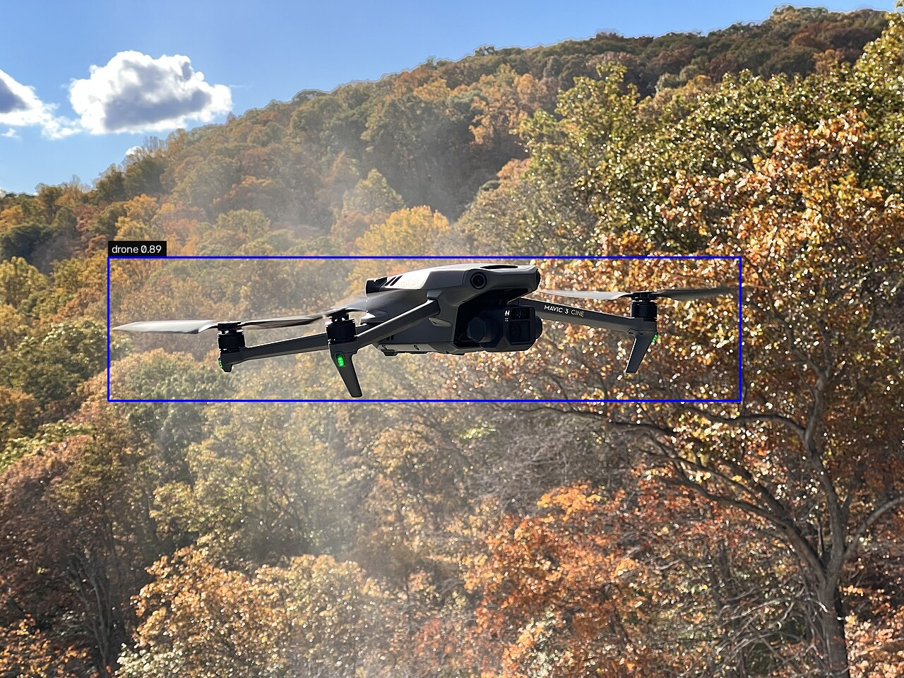
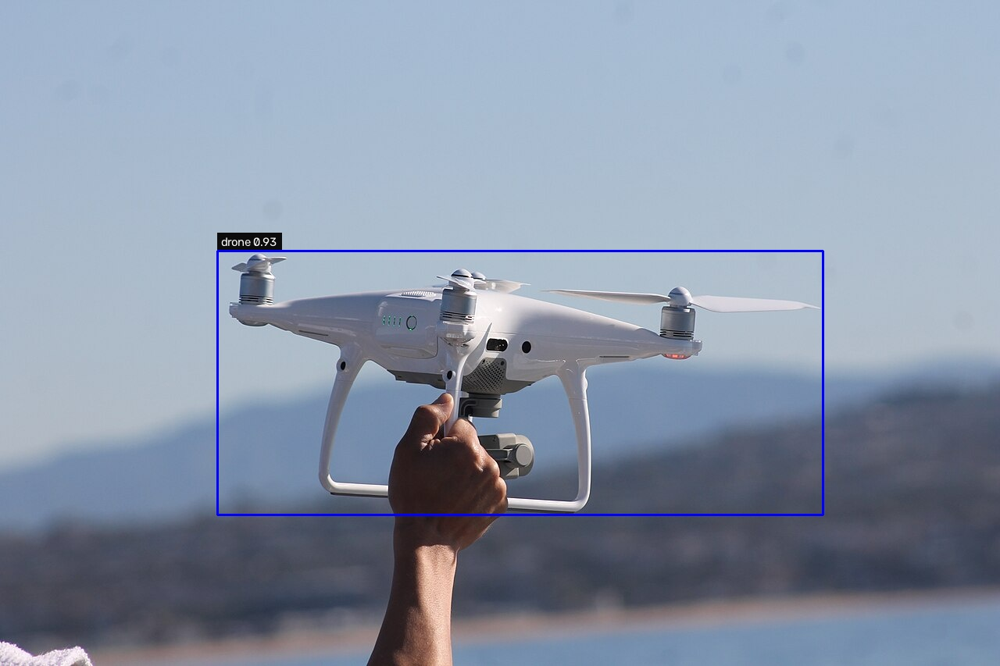
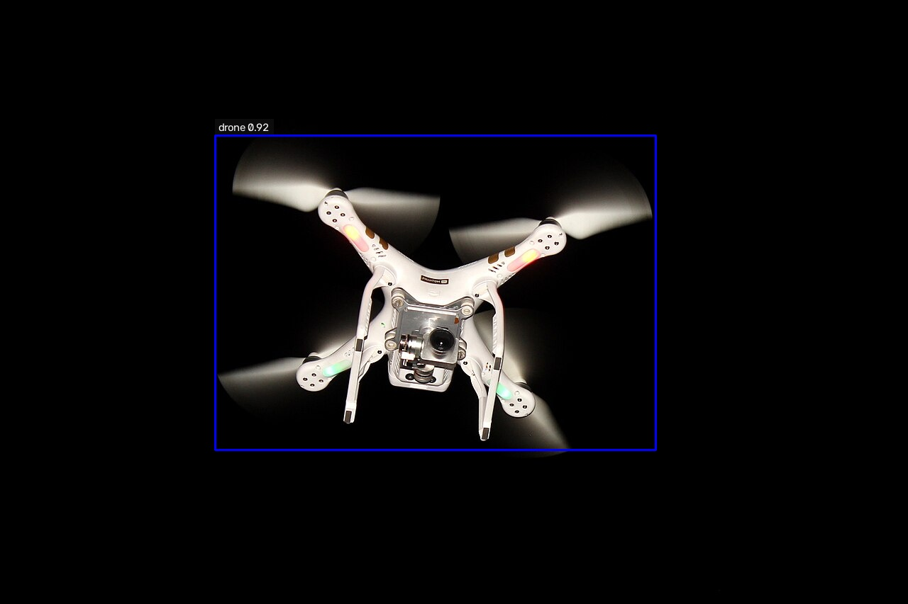
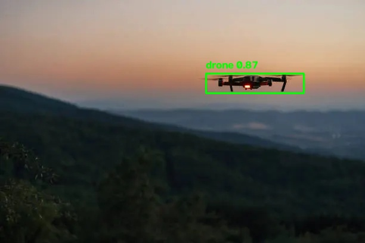
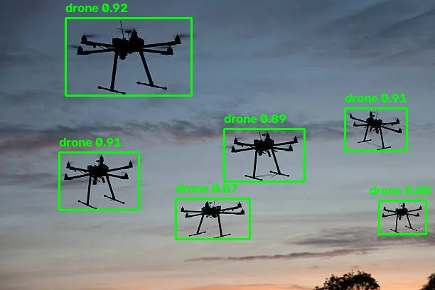
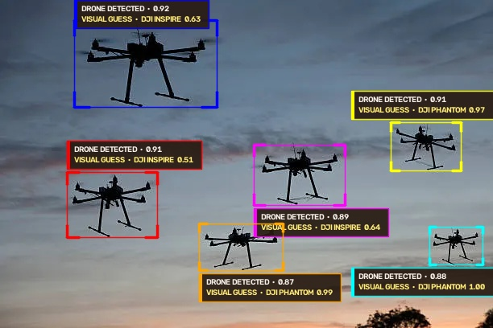
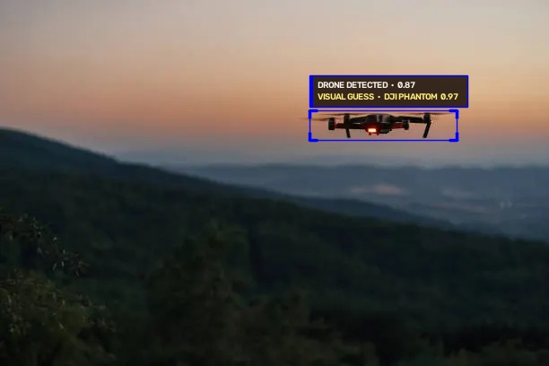
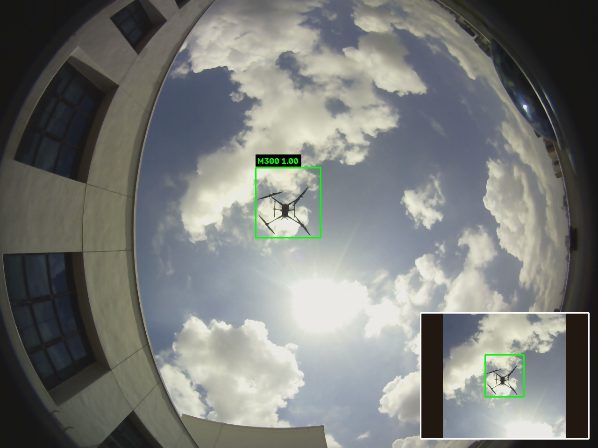
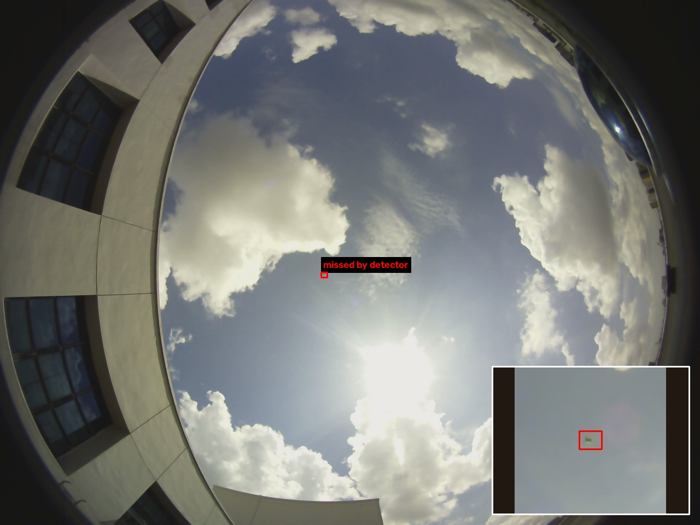
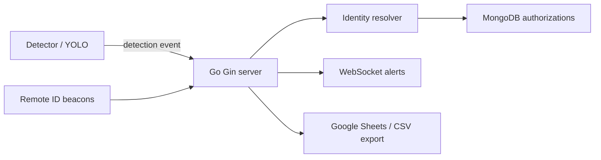

# Drone Detect App

<p align="center">
  
  
  
  
  
  
</p>

A local drone detection and authorization system that combines computer vision, real-time event processing, and rule-based identity verification. The detector runs YOLO on live or recorded sources, the Go server resolves identity and authorization status, and MongoDB stores every detection. Identified detections are exported to Sheets or CSV by default.

## Tech stack

| Layer | Technologies |
| --- | --- |
| Vision + detection | Python, `uv`, Ultralytics YOLO, OpenCV, PyTorch |
| Live backend | Go, Gin, Gorilla WebSockets |
| Identity + decisioning | Go server logic, MongoDB lookups, zone-aware authorization checks |
| Storage | MongoDB Community Server |
| Reporting | Google Sheets API + local CSV fallback |
| Automation | PowerShell, Makefile, pytest, Go tests |

## Overview

This project is designed to answer a simple but important operational question: when a drone is detected in a monitored area, is it authorized to be there, and who is it? The detector identifies a drone, emits a real-time event, and the server correlates it with Remote ID beacons and visual attributes to decide whether the flight is authorized or not.

The system supports:

- Drone detection from images, folders, videos, and streams
- Tracking with `track_id` dedupe and cooldown logic
- Remote ID beacon matching by zone and timestamp
- Visual attribute-based verification (`airframe_type`, `model_family`)
- MongoDB-backed drone and authorization checks
- Live alerts over WebSocket
- Export to Google Sheets with CSV fallback

**Visual model scope:** the detector first locates a generic `drone`, then an
optional image classifier predicts a supported family from the cropped box.
The production checkpoint predicts broad Mavic/Phantom/Inspire labels; an
experimental MMAUD checkpoint was evaluated for Mavic 2, Mavic 3, Phantom 4,
Avata, and M300 but was not promoted. The family prediction is soft visual
evidence in the snapshot, alerts, and sheet; registered identity still comes
from a serial or Remote ID match to MongoDB.

## YOLO detector output

These detector outputs show the model's actual `drone` predictions. They do
not claim to recognize a product model from pixels:

The following real-world Wikimedia Commons examples were added to `images/`
and rendered with YOLO-only boxes. The box label remains `drone`; the source
photo's exact product name is ground truth supplied by the photo page, not a
prediction from this model. See [media credits and licenses](./docs/SHOWCASE_MEDIA.md).

<p align="center">
  
</p>
Credit: [HKesteloo, CC BY-SA 4.0](https://commons.wikimedia.org/wiki/File:DJI_Mavic_3.jpg).

<p align="center">
  
</p>
Credit: [Noah Wulf, CC BY-SA 4.0](https://commons.wikimedia.org/wiki/File:DJI_Phantom_4_Being_Released_from_Ship.jpg).

<p align="center">
  
</p>
Credit: [Suyash Dwivedi, CC BY-SA 4.0](https://commons.wikimedia.org/wiki/File:DJI_Phantom_4K_drone_in_action.jpg).

These annotated images are adaptations of the credited photos and are shared
under the same CC BY-SA terms. The input photos themselves remain gitignored.

<p align="center">
  
</p>

<p align="center">
  
</p>

### Visual family prediction

These examples also run a separate classifier on each YOLO crop. `VIS` marks
the classifier's broad family prediction and confidence; it is not a registered
product model or unique drone identity.

<p align="center">
  
</p>

<p align="center">
  
</p>

### Real-footage family experiment (experimental)

The MMAUD V1 experiment evaluates a separate candidate on real, wide-angle
frames. It reached **58.7% family accuracy** across Mavic, Phantom, Avata, and
M300 on 584 held-out crops. In the full detector-plus-classifier path, the
detector missed **78.1%** of labeled targets, so only **10.8%** received the
correct family label end to end. The test segments were held out temporally but
come from flights also represented in training; cross-scene performance is
unknown. The 80% target was not met, and the candidate is not the production
checkpoint.

<p align="center">
  
</p>
Credit: MMAUD V1, Yuan et al., ICRA 2024; shared under CC BY-NC-SA 4.0. See
[dataset attribution](./docs/MMAUD_ATTRIBUTION.md).

<p align="center">
  
</p>
Credit: MMAUD V1, Yuan et al., ICRA 2024; shared under CC BY-NC-SA 4.0.
The red inset is the labeled target that the detector failed to find.

`images/` and `videos/` stay read-only inputs; the runtime detection snapshots live under `data/snapshots/` (gitignored — safe to delete any time).

## Architecture at a glance



## Project documentation

- [PROJECT.md](./PROJECT.md) — roadmap, architecture, version snapshot, milestones
- [DESCRIPTION.md](./DESCRIPTION.md) — contract and source-of-truth behavior for events, decision logic, and schemas
- [docs/ARCHITECTURE.md](./docs/ARCHITECTURE.md) — deeper repo map and diagrams
- [docs/TRAINING.md](./docs/TRAINING.md) — training and dataset notes
- [docs/MMAUD_REPORT.md](./docs/MMAUD_REPORT.md) — real-footage experiment, metrics, and limitations
- [docs/NEXT_NOVEMBER.md](./docs/NEXT_NOVEMBER.md) — gaps found and recommended next steps

## Repository structure

```text
.
├── detector/                  # YOLO detector, tracking, event generation
├── server/                    # Gin API and decision engine
├── tools/                     # seed DB, simulator, fake detector utilities
├── scenarios/                 # Remote ID / test scenario JSON files
├── images/                    # sample images used for testing and docs
├── videos/                    # sample videos used for testing
├── docs/                      # architecture and training notes
├── data/                      # snapshots, export outputs, app data
├── PROJECT.md                 # milestones and architecture overview
├── DESCRIPTION.md             # rules, schemas, and protocol contracts
├── README.md                  # project overview and quick start
├── Makefile                   # shortcut automation for common tasks
├── .env.example               # environment template
└── scripts/                   # demo and run helpers
```

## Quick start (Windows PowerShell)

Prerequisites:

- MongoDB Community Server running at `mongodb://localhost:27017`
- Repo-root `.env` created from `.env.example`

### Option 1: use the provided automation

```powershell
make server
```

If the database has no seeded records, use `uv run tools/seed_db.py --keep`
from the repository root to add missing demo records without dropping the
existing `drone_detect_app` database. `make seed` intentionally wipes and
recreates that database.

### Option 2: run each service manually

```powershell
# 1. Add missing mock data without wiping existing records
uv run tools\seed_db.py --keep

# 2. Run the server
cd server
go run .\cmd\server
# dashboard: http://localhost:8080/ (manual run uses .env)
# health: http://localhost:8080/health

# 3. Run the detector
cd ..
cd detector
.\.venv\Scripts\python.exe -m detector.main --source ..\images --clock video
```

### Simulated Remote ID and fake detections

```powershell
uv run tools\remote_id_sim.py --scenario scenarios\showcase.json --mode preload
uv run tools\fake_detector.py --scenario scenarios\showcase.json
```

### Demo helpers (everything runs through make)

```powershell
make check      # mongo, port, ADC, sheet reminder
make gpu-check  # torch device (expect cuda=True on NVIDIA GPUs)
make seed       # destructive: wipe + re-create mock data
make server     # Go server (leave running)
make sim        # preload Remote ID beacons
make fake       # scripted detections, checks acks
make dashboard  # open the live page in a browser
make webcam     # live YOLO on webcam 0 (q quits)
```

### Full local demo walkthrough (Windows)

Use three terminals from the repository root. First, run `make check` and
confirm it ends with `Ready`. Start the server in Terminal 1:

```powershell
make server
```

Open the dashboard in a browser at `http://localhost:8000/` (or run
`make dashboard`). In Terminal 2, run the detector on the supplied video:

```powershell
make yolo VIDEO="Imagine Seeing THIS Many DJI Drones Flying.mp4" STRIDE=2
```

The preview labels boxes with a visual family when the optional classifier
returns one. Press `q`, press Escape, or close the preview window to stop the
current video and the rest of the folder run. The video is a read-only input.
Detections without a matching beacon appear as unidentified. After it finishes,
run the scripted authorization flow in Terminal 3:

```powershell
make sim
make fake
```

The simulator scenario is synthetic and tests the backend decisions: an
authorized drone, a silent drone, a visual mismatch, a no-fly zone, ambiguous
beacons, and an unregistered serial. `make fake` should report **9/9 checks
passed**. This proves the event and authorization flow; it is not evidence
that the camera visually recognized each registered model.

For family-level visual recognition, the project includes a training path in
[docs/TRAINING.md](./docs/TRAINING.md#1-assemble-the-dataset). After downloading
and extracting the CC BY dataset and training `family.pt`, run:

```powershell
cd detector
$env:ATTR_FAMILY_ENABLED = "true"
uv run python -m detector.main --source "..\videos\Imagine Seeing THIS Many DJI Drones Flying.mp4" --clock video --display --stride 2
```

The annotated snapshots and dashboard show the visual family with its
confidence separately from the registered drone identity. The production
checkpoint was trained on synthetic images; its real-media predictions are
unreliable. The newer MMAUD candidate is also experimental and misses the 80%
target; see the [real-footage evaluation](./docs/MMAUD_REPORT.md) before using
either model in a showcase claim.

To create image-only showcase artifacts without sending events to the server,
run these commands from `detector/`:

```powershell
$env:ATTR_FAMILY_CONF = "0.75"
uv run tools\render_family_showcase.py --source ..\images --output-dir ..\screenshots
```

For detector-only overlays on the credited real-world examples, omit the
experimental family classifier:

```powershell
uv run tools\render_family_showcase.py --source ..\images\web-dji-mavic-3.jpg --output-dir ..\screenshots --detection-only
```

## How the system works

1. The detector reads frames from an image, video, or stream.
2. YOLO identifies drone objects and emits a detection event.
3. The server validates and enriches the event.
4. It resolves identity using explicit identifiers or Remote ID beacons; visual attributes can verify or disambiguate a candidate.
5. It looks up authorization for the zone and time of detection.
6. It decides whether the drone is `authorized`, `unauthorized`, or `unidentified`.
7. It publishes alerts and exports the record for auditing.

## Testing

```powershell
cd server
 go test ./...
 go vet ./...

cd ..\detector
.\.venv\Scripts\python.exe -m pytest -q
```

## Notes

- `videos/` and `images/` are treated as read-only inputs.
- Google Sheets export requires a configured spreadsheet and a `detections` tab; otherwise the system falls back to local CSV export.
- This project follows the contracts in [DESCRIPTION.md](./DESCRIPTION.md) as the source of truth.

## License and project status

This project is currently a local development and validation system for drone detection, real-time authorization checks, and alerting workflows. It is structured to evolve toward more robust deployment, training, and operational monitoring workflows.
