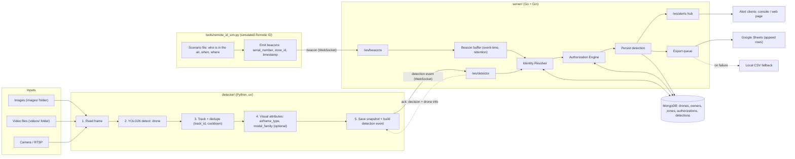
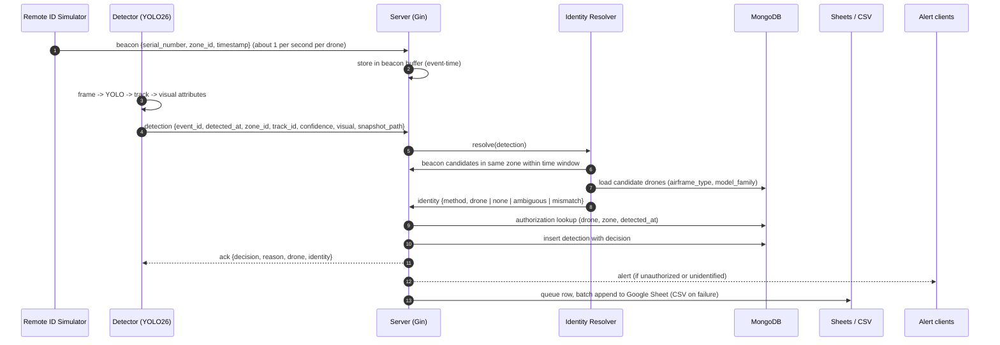
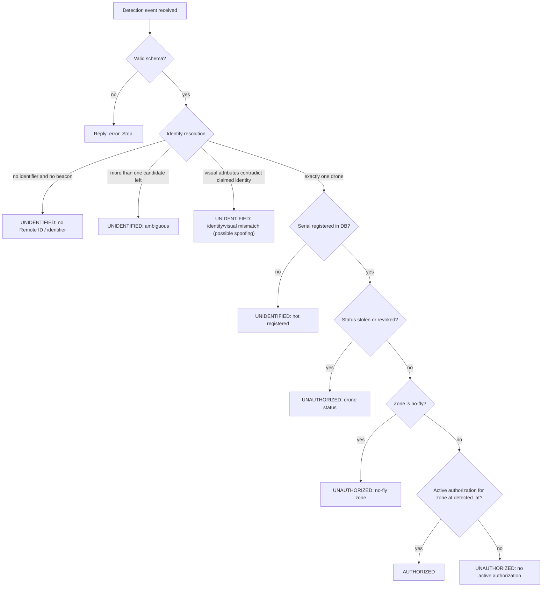

# Architecture (M8)

Source of truth for contracts stays `DESCRIPTION.md`; milestone order and the
version snapshot stay `PROJECT.md` 2/8. This file reuses the pipeline diagrams
so the running code can be checked against them in one place.

## End-to-end flow



## Sequence for one detection



## Decision flow



## Repo map (what runs where)

```
drone-detect-app/
  detector/src/detector/  YOLO wrapper (detect.py), airframe map (Stage B),
                          family classifier (attributes.py, Stage C, flagged),
                          tracking/dedupe, sources, events, ws_client, main CLI
  detector/tools/         evaluate.py (FP/min probe on images/ + videos/)
  detector/models/        *.pt weights (gitignored): drone.pt, family.pt
  server/cmd/server       wiring (config, Mongo, hub, worker, notifier, routes)
  server/internal/ws      /ws/detector, /ws/beacons, /ws/alerts + hub
  server/internal/identity  beacon buffer + resolver (explicit/beacon/visual)
  server/internal/authorization  decision engine (order in DESCRIPTION.md 5)
  server/internal/export  Sheets append + CSV fallback + retry worker
  server/internal/notify  console notifier (best-effort, never blocks)
  server/internal/api     GET / dashboard, GET /health, /snapshots static
  tools/                  seed_db.py, fake_detector.py, remote_id_sim.py
  docs/                   TRAINING.md (this milestone), ARCHITECTURE.md
```

## Failure behavior (stage table, condensed)

| Stage | On failure |
|---|---|
| Read / Detect | Skip frame, log; stop at end of source |
| Track + dedupe | Never emit without a `track_id` |
| Visual attributes | Omit `visual` (resolver skips the cross-check) |
| Event / send | Bounded queue, reconnect with backoff |
| Beacons | Reconnect; beacons are not persisted |
| Resolve / Decide | `unidentified`, logged, never a crash |
| Persist + reply | Reply `error`, keep the connection |
| Notify | Slow `/ws/alerts` clients evicted, never block |
| Export | Retry with backoff, CSV fallback, `export_status` tracked |
